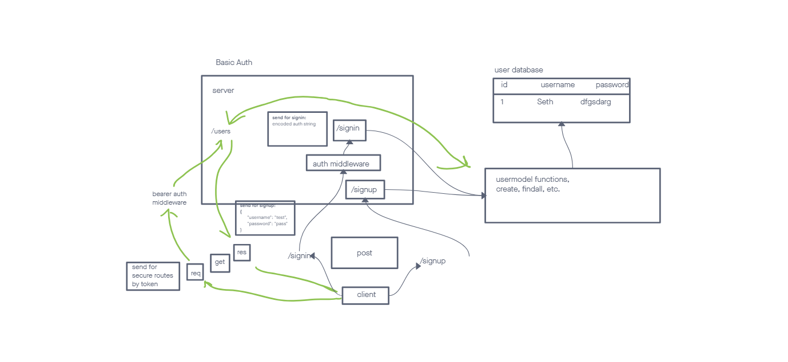

# LAB - Lab-07

## Project: auth-server

### Author: Seth Pierce

### Problem Domain

Fix all the bugs found in the code.
Create an API that uses Auth Basic to create a user, and allow a user to login on /signup and /signin
add Bearer token for a path /users that requires a token to view

### Links and Resources

- [ci/cd](https://github.com/sethppierce/bearer-auth/actions) (GitHub Actions)
- [server-prod](https://auth-server-8gst.onrender.com)

### Setup

#### `.env` requirements (where applicable)

see `.env.sample`

#### How to initialize/run your application (where applicable)

- nodemon

#### Features / Routes

- Feature one: Deploy to Prod
- GET : `/` - specific route to hit
- `/signin` : POST - login as user
- `/signup` : POST - create one user
- `/users` : GET - Read all usernames if user has Bearer token
- `/secret` : GET - View data if user has Bearer token

#### Tests

- How do you run tests?
  - npm test
- Any tests of note?
  - handles root path
  - handles invalid paths
  - handles every CRUD function
- Describe any tests that you did not complete, skipped, etc
  - all tests complete

#### UML

